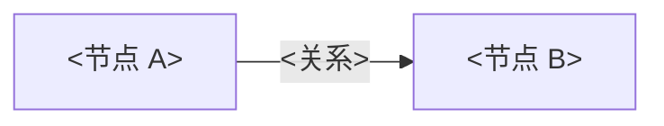

# <课程主题>

![[cover.jpg|500]]

> [!abstract] 视频信息
> - **作者/频道**：<UP 主>
> - **发布日期**：<YYYY-MM-DD>
> - **时长**：<X 分 Y 秒>
> - **链接**：[<BV号>](https://www.bilibili.com/video/<BV号>/)
> - **处理范围**：<全片 / 第 N P / 字幕来源：ai-zh 字幕、语音转写或纯画面>
> - **笔记制作 Skill**：bilibili-render-obsidian（video-to-obsidian）

> [!tip] 时间戳
> 每张截图下方的时间可以点击，会跳到 B 站视频的对应位置。

%% 正文从这里开始，替换下面的示例。
   - 编号标题：## 1 …、### 1.1 …；每个大节以 ### 本章小结 结尾；全文以 ## N 总结与延伸 结尾。
   - 截图 = 嵌入行 + 紧跟的斜体图注行，中间不能空行；图注里的时间区间可点击（?t=起始秒数，分P 加 &p=N）。
   - 图片不要放进 callout 或表格。
   - cover.jpg 在发布时会被脚本改名为 <短主题名>_cover.jpg，并同步改写这里的引用。 %%

## 1 引言：<这条内容要解决什么问题>

<动机与全局脉络。>

![[<semantic_frame_name>.jpg|600]]
*图 1：<画面里实际可见的内容>。[00:00:05–00:00:19](https://www.bilibili.com/video/<BV号>/?t=5)*

<先用直白的中文解释公式想表达什么、为什么出现。>

$$
<display math>
$$

- $<符号>$：<含义>。

> [!important] <核心概念>
> <读者必须带走的定义或结论。>

> [!info] 补充：<视频之外的背景知识>
> <不属于视频原话的补充，单独标明。>

> [!warning] <常见误解>
> <误解是什么、为什么错、正确理解是什么。>

### 本章小结

- <要点>

## <N> 总结与延伸

### <N>.1 作者的收尾

<作者有实质内容的结尾讨论，不含求赞、群号等话术。>

### <N>.2 <对比表 / 统一视角>

| <维度> | <方法 A> | <方法 B> |
|---|---|---|
| <…> | <…> | <…> |

### <N>.3 实践建议与开放问题

- <可执行的建议或值得继续追问的问题>

### <N>.4 拓展阅读

- <作者, *标题* (会议 年份)>: <URL>
